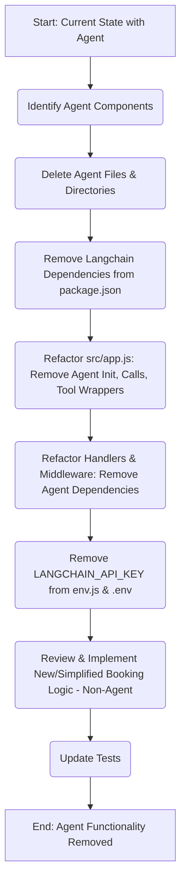

## Refactoring Plan: Remove AI Agent Functionality

**Branch:** `Major_Refactor_No_Agent`

**Primary Goal:** Remove all AI agent functionality, including associated code, dependencies, and imports, and clean up the codebase.

---

### 1. Files and Directories to be Deleted:

The following files and directories are identified as being solely related to AI agent functionality and should be deleted:

*   **`src/agents/`** (entire directory)
    *   Reason: Contains [`src/agents/bookingAgent.js`](src/agents/bookingAgent.js:1), which is the core agent logic.
*   **[`src/config/agentPrompts.js`](src/config/agentPrompts.js:1)**
    *   Reason: Contains system prompts specifically for the AI agent.
*   **`src/graph/`** (entire directory)
    *   Files: [`bookingGraph.js`](src/graph/bookingGraph.js:1), [`edges.js`](src/graph/edges.js:1), [`nodes.js`](src/graph/nodes.js:1), [`state.js`](src/graph/state.js:1), and any `.gitkeep` files.
    *   Reason: This directory implements the `langgraph` state machine for conversational flow, which is tied to the agent.
*   **`src/memory/`** (entire directory)
    *   File: [`src/memory/sessionMemory.js`](src/memory/sessionMemory.js:1)
    *   Reason: Manages conversation memory using `langchain`'s `BufferMemory`, confirmed by the user to be for agent memory.
*   **Test files related to agent functionality:**
    *   Example: `tests/agents/bookingAgent.test.js` (if it exists, as suggested by the `test` script in [`package.json`](package.json:7)). Other related test files should also be identified and removed.

---

### 2. Code Modifications and Removals:

#### A. Dependency Removals in [`package.json`](package.json:1):

*   Remove the following `langchain` and related dependencies from the `dependencies` section:
    *   [`@langchain/anthropic`](package.json:21)
    *   [`@langchain/community`](package.json:22)
    *   [`@langchain/google-genai`](package.json:23)
    *   [`@langchain/langgraph`](package.json:24)
    *   [`@langchain/openai`](package.json:25)
    *   [`langchain`](package.json:36)
*   **Script update:**
    *   Modify the `"test"` script (line 7) to remove any references to agent-specific test files (e.g., `-x tests/agents/bookingAgent.test.js`).

#### B. Modifications in [`src/app.js`](src/app.js:1):

*   **Remove Imports:**
    *   `const { DynamicStructuredTool } = require("langchain/tools");`
*   **Modify `initializeApp` function:**
    *   **Dependency Destructuring & Validation:**
        *   Remove `bookingAgent`
        *   Remove `graphNodes`
        *   Remove `initializeGraph`
        *   Remove `graphEdges`
    *   **Tool Instantiations:**
        *   Remove all `DynamicStructuredTool` wrapper instantiations (e.g., `findFreeSlotsTool`, `createCalendarEventTool`, `resetUserStateTool`, etc.). The underlying service methods (e.g., `googleCalendarInstance.findFreeSlots()`) might still be needed and will require direct invocation if their functionality is to be preserved outside the agent context.
    *   **Agent and Graph Initialization:**
        *   Remove `await bookingAgent.initializeAgent(...)` call.
        *   Remove `graphNodes.initializeNodes(...)` call.
        *   Remove `bookingGraphInstance = initializeGraph(...)` call.
    *   **Handler Initialization - Remove Agent/Graph Dependencies:**
        *   Within `callbackHandler.initialize`: Remove `bookingAgent: bookingAgent`.
        *   Within `updateRouter.initialize`: Remove `bookingAgent: bookingAgent`.
        *   Within `updateRouter.initialize`: Remove `bookingGraph: bookingGraphInstance`.
    *   **Return Object:**
        *   Remove `bookingAgent`.
        *   Remove `bookingGraph: bookingGraphInstance`.

#### C. Modifications in [`src/core/env.js`](src/core/env.js:1):

*   Remove `langchainApiKey: process.env.LANGCHAIN_API_KEY,`
*   The corresponding `LANGCHAIN_API_KEY` should also be removed from the `.env` file(s).

#### D. Modifications in Other Files:

*   **[`src/handlers/callbackQueryHandler.js`](src/handlers/callbackQueryHandler.js:1):**
    *   The `initialize` function likely takes `bookingAgent` as a dependency. This dependency must be removed.
    *   Any logic within this handler that invokes `bookingAgent` or relies on the agent's conversational flow or state needs to be refactored or removed.
*   **[`src/middleware/updateRouter.js`](src/middleware/updateRouter.js:1):**
    *   The `initialize` function takes `bookingAgent` and `bookingGraph` as dependencies. These dependencies must be removed.
    *   Logic that routes updates to the agent or graph needs to be refactored or removed. This middleware might become significantly simpler or its responsibilities might shift.
*   **Search for any remaining imports or usage:**
    *   After the above changes, a global search for `bookingAgent`, `graphNodes`, `initializeGraph`, `graphEdges`, `StateGraph`, `DynamicStructuredTool`, and other specific `langchain` imports should be performed to catch any missed references.

---

### 3. Potential Impacts and Considerations:

*   **Booking Functionality:**
    *   The primary impact will be on how bookings are handled. The conversational AI-driven booking flow will be removed.
    *   If booking functionality is to be retained, it will need to be driven by simpler mechanisms, such as direct commands (e.g., `/book`), or a more structured (non-AI) interactive flow.
    *   The core logic within tools like [`src/tools/googleCalendar.js`](src/tools/googleCalendar.js:1) and [`src/tools/stateManager.js`](src/tools/stateManager.js:1) (which were wrapped by `DynamicStructuredTool`) will likely need to be called directly by the new booking implementation.
*   **User Interaction Model:**
    *   Users will no longer be able to interact with the bot using natural language for booking purposes that were handled by the agent.
    *   Clear communication about the new interaction model (e.g., available commands) will be necessary.
*   **State Management for Booking:**
    *   The `BookingState` defined in [`src/graph/state.js`](src/graph/state.js:1) will be gone. If a multi-step booking process is retained without the agent, a new, simpler state management approach for that process might be needed, potentially leveraging [`src/tools/stateManager.js`](src/tools/stateManager.js:1) in a more direct way.
*   **Error Handling:**
    *   The graph included an `handleErrorNode`. Error handling for any new booking implementation will need to be robust.
*   **Testing:**
    *   Existing tests for agent functionality will be removed. New tests will be required for any refactored or new booking logic.

---

### 4. Refactoring Steps Overview (Conceptual):

---

This plan provides a comprehensive guide for removing the AI agent functionality. The "Code" mode will need to carefully implement these changes, paying close attention to how the removal of agent-driven orchestration affects the remaining booking logic.